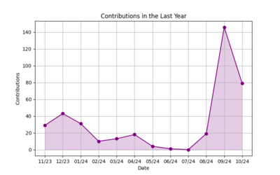

# Nikita Kozgunov

### About Me

- 🎓 Pursuing Master in Data Science & Engineering @ [The University of Saint-Petersburg State University](https://spbu.ru/)
- 📚 Research in AI and integration LLM into ... @ [TICS Lab](https://dscs.pro/students/2024-spring/козгунов-никита-владимирович-2/)
- 🔬 Designing&Constructing [**Dynamical Decentralized Large Language Model**](https://ieeexplore.ieee.org/document/10554241/metrics#metrics) for Common usage

---

### 🔧 Top Languages

- Python
- Jupyter Notebook
- С++

---

## 📂 My Open-Source Projects

  
  ## Machine Learning Projects

| Title | Direction | Technologies |
|-------|-------|--------------|
| [NN&Viola-Jones](https://github.com/kozgunov/Viola_Jones_alg_faces) | CV, AI |  |
| [Removing-Frontground (in process...)](https://github.com/kozgunov/my_ai/tree/main/CV%2BNLP/removing%20text%20from%20photo) |  |   |
| [DLLM&Blockchain (in training...)](https://github.com/kozgunov/diploma-research) |  |   |
| [Real-Time-Object-Detection  (in process...)](https://github.com/kozgunov/modelling-research) |  |   |
| [6-Llama-MoE (in process...)](https://github.com/kozgunov/MoE/tree/main/LLaMa_Union) |  |   |
| [Stable-diffusion (in process...)](https://github.com/kozgunov/my_ai/tree/main/CV/stable_diffusion) |  |  |
| [Unstable-diffusion (in process...)](https://github.com/kozgunov/my_ai/tree/main/CV/unstable_diffusion) |  |   |
| [Semantic Stock Analysis](https://github.com/kozgunov/my_ai/blob/main/LLM%26NLP/sentiment%20stock%20analysis) |  |   |
| [Approximation-To-PDE](https://github.com/kozgunov/Approximation-to-PDE) |  |   |
| [Local-Finance-Analysis](https://github.com/kozgunov/my_ai/tree/main/app%26program/local_finance) |  |   |

## Bots

| Title | Stars | Technologies |
|-------|-------|--------------|
| [Stock&Crypto Prediction (in process...)](https://github.com/kozgunov/stock-crypto_bot) |  |   |
| [Discord bot (in process...)](https://github.com/kozgunov/my_ai/tree/main/app&program/Discord_bot) |  |   |
| [LLaMa2.7-Telegram-bot (in process...)](https://github.com/kozgunov/LLaMa-bot) |  |   |
| [Own-news-hub](https://github.com/kozgunov/my_ai/tree/main/app%26program/own_news_hub) |  |  |
| [Forex-bot (in process...)](https://github.com/kozgunov/my_ai/tree/main/app%26program/Forex_bot) |  |   |
| [Footballer-TicTacToe-bot (in process...)](https://github.com/kozgunov/TicTacToe) |  |   |
| [Auto-offside-detecting-bot (in process...)](https://github.com/kozgunov/my_ai/tree/main/CV/Football_Deep_Analisys) |  |   |

## Helpful Algorithms

| Title | Stars | Technologies |
|-------|-------|--------------|
| [A* (in editing)](https://github.com/kozgunov/internal-tests/blob/main/A*) |  |   |
| [Deapth-First-Search](https://github.com/kozgunov/internal-tests/blob/main/dfs.py) |  |   |
| [Breath-First-Search](https://github.com/kozgunov/internal-tests/blob/main/bfs.py) |  |   |
| [Q-learning (in process...)](https://github.com/kozgunov/my_ai/blob/main/app%26program/Q-learning) |  |   |
| [KAN](https://github.com/kozgunov/internal-tests/blob/main/KANs) |  |   |
| [Exchange-Rate (in process...)](https://github.com/kozgunov/python-games/blob/main/exchanging%20rates) |  |   |

# GitHub Stats

### Contributions in the Last Year

### Top Languages by Repo

### Top Languages by Commit

Contact:
* 📫 reserveknik@gmail.com

